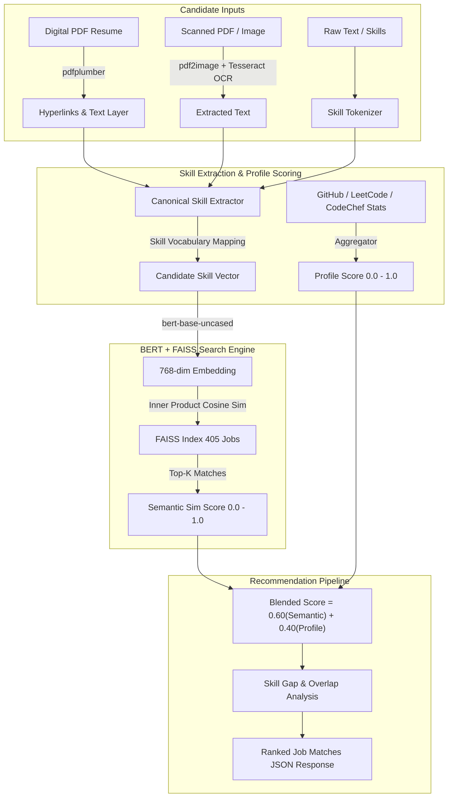

# SkillSync — Career Intelligence Platform

> **Semantic job matching, multi-format OCR resume extraction, multi-platform profile aggregation, and AI-powered career intelligence — built with BERT & FAISS.**

[](https://python.org)
[](https://fastapi.tiangolo.com)
[](https://pytorch.org)
[](https://huggingface.co/bert-base-uncased)
[](https://github.com/facebookresearch/faiss)
[](https://github.com/tesseract-ocr/tesseract)
[](LICENSE)

---

## 📌 Table of Contents

- [Overview](#-overview)
- [Key Features](#-key-features)
- [System Architecture](#-system-architecture)
- [Implementation & Module Verification Status](#-implementation--module-verification-status)
- [Project Directory Structure](#-project-directory-structure)
- [Machine Learning R&D & Benchmarking](#-machine-learning-rd--benchmarking)
- [Dataset Description](#-dataset-description)
- [NLP Architecture & Blended Scoring](#-nlp-architecture--blended-scoring)
- [Backend API Reference](#-backend-api-reference)
- [Getting Started & Local Verification](#-getting-started--local-verification)
- [Tech Stack & Dependencies](#-tech-stack--dependencies)
- [Author & License](#-author--license)

---

## 🌐 Overview

**SkillSync** is a full-stack career intelligence platform engineered for students, early-career professionals, and recruiters. It bridges candidate qualifications with job market expectations by combining **dense vector semantic search (BERT + FAISS)**, multi-format resume signal extraction (digital PDFs, scanned document OCR, image uploads), multi-platform coding profile aggregation (GitHub, LeetCode, CodeChef, HackerRank), and detailed skill gap diagnostics.

> [!NOTE]
> SkillSync goes beyond basic keyword matching. It uses deep transformer embeddings (`bert-base-uncased`) to understand contextual relationships between candidate skills, job roles, and domain requirements.

---

## ✨ Key Features

- 🎯 **Semantic Vector Retrieval**: 768-dimensional FAISS inner-product vector search (`IndexFlatIP`) matching candidate skills with 405+ precomputed job embeddings.
- 📄 **Multi-Format Resume Signal Parsing**:
  - **Digital PDFs**: High-speed text and embedded hyperlink extraction (`mailto:`, GitHub, LinkedIn, live demo links) via `pdfplumber`.
  - **Scanned PDFs & Photos**: Robust OCR processing pipeline using `pdf2image` and `pytesseract` for scanned documents or image uploads (PNG/JPG/WEBP).
- 🔗 **Project Link Quality Analysis**: Automatically evaluates candidate project links for repository quality (`good` vs `bad` link status) and provides actionable feedback.
- 📊 **Multi-Platform Profile Aggregation**: Automatically fetches stats from GitHub, LeetCode, CodeChef, and HackerRank to calculate a unified candidate **Profile Score**.
- 🧮 **Blended Recommendation Scoring**: Combines semantic skill similarity ($60\%$) with candidate profile metrics ($40\%$) to rank matches accurately.
- 🔍 **Skill Gap Diagnostics**: Provides line-item analysis of candidate skill overlaps, missing skills, and overall percentage readiness per job match.

---

## 🏗️ System Architecture



---

## 📋 Implementation & Module Verification Status

| Module | Sub-component | Status | Implementation Details |
| :--- | :--- | :---: | :--- |
| **Data Pipeline** | Dataset Preprocessing | ✅ **Completed** | Cleaned 415 raw job postings → 405 unique rows (`jobs_clean.csv`). Applied alias expansion, IQR salary Winsorisation, and experience mapping. |
| **ML Engine** | Model Evaluation | ✅ **Completed** | Benchmarked `bert-base-uncased` vs `all-MiniLM-L6-v2`. `bert-base-uncased` selected as production winner (MRR: `0.8579`, P@5: `0.7022`). |
| **Vector Index** | FAISS Indexing | ✅ **Completed** | 768-dimensional `IndexFlatIP` vector index containing 405 job embeddings saved at `ml/notebooks/ml/embeddings/faiss_index.bin`. |
| **Resume & OCR** | Multi-Format Parser | ✅ **Completed** | Digital PDF link parsing (`pdfplumber`) + OCR fallback (`pytesseract`) + project link quality validator (`backend/core/resume_ocr.py`). |
| **Backend API** | FastAPI Service (`v2.0.0`) | ✅ **Completed** | Production FastAPI app (`backend/main.py`) with singleton engine, CORS middleware, Pydantic v2 schemas, and health checks. |
| **Validation Suite**| Notebook Test Suite | ✅ **Completed** | 12-test suite (`T1`–`T8`) verifying single skill, multi-skill, noisy input, domain filtering, and edge cases. All assertions passing. |
| **Frontend UI** | React + TypeScript App | ⏳ *Planned* | Frontend structure initiated (`frontend/`). UI components for resume upload and interactive match breakdown to be finalized. |

---

## 📁 Project Directory Structure

```
Skill-Sync/
├── backend/
│   ├── core/
│   │   ├── __init__.py
│   │   ├── engine.py              # Singleton loading BERT model, FAISS index & matching logic
│   │   ├── extractor.py           # Skill vocabulary (100+ canonical skills) & section-aware parser
│   │   ├── profile_extractor.py   # Aggregates stats from GitHub, LeetCode, CodeChef, HackerRank
│   │   └── resume_ocr.py          # PDF text/hyperlink extraction & Tesseract OCR for scanned docs
│   ├── models/
│   │   ├── __init__.py
│   │   └── schemas.py             # Pydantic v2 schemas for requests, responses & health status
│   ├── routes/
│   │   ├── __init__.py
│   │   └── recommend.py           # REST endpoints for recommendations, OCR, skill extraction & filtering
│   ├── main.py                    # FastAPI app entry point, CORS, lifespan startup & error handlers
│   └── requirements.txt           # Python backend dependencies
├── ml/
│   ├── datasets/
│   │   ├── jobs_clean.csv         # Preprocessed dataset (405 job postings)
│   │   ├── preprocess.md          # Preprocessing specification document
│   │   ├── preprocess.py          # 9-step dataset cleaning pipeline script
│   │   └── skillsync_final_dataset.csv # Raw dataset (415 records across 14 domains)
│   └── notebooks/
│       ├── ml/embeddings/         # Saved model artifacts
│       │   ├── faiss_index.bin    # FAISS vector index (405 vectors x 768 dimensions)
│       │   ├── job_embeddings.npy # Precomputed NumPy embedding matrix
│       │   ├── job_metadata.json  # Serialized job metadata dictionary
│       │   └── model_info.json    # Model metadata & configuration
│       └── skillsync_model.ipynb  # R&D notebook: evaluation, FAISS indexing & 12-test validation suite
├── docs/                          # Technical specifications and API documentations
├── frontend/                      # React + TypeScript frontend codebase
├── .env.example                   # Environment configuration template
├── .gitignore                     # Git ignore rules
└── README.md                      # Project documentation and system architecture guide
```

---

## 🧪 Machine Learning R&D & Benchmarking

The notebook [`ml/notebooks/skillsync_model.ipynb`](file:///d:/Skill-Sync/ml/notebooks/skillsync_model.ipynb) documents model architecture selection, vector index construction, and validation.

### Model Benchmarking Comparison

Two transformer models were evaluated on the 405-job dataset:
1. **Model A (`bert-base-uncased`):** Mean-pooling over non-padding tokens (768 dimensions).
2. **Model B (`all-MiniLM-L6-v2`):** Default sentence-transformers pooling (384 dimensions).

| Metric | Model A (`bert-base-uncased`) | Model B (`all-MiniLM-L6-v2`) | Winner / Advantage |
| :--- | :---: | :---: | :--- |
| **Mean Reciprocal Rank (MRR)** | **0.8579** | 0.7972 | 🏆 **BERT (+7.6%)** |
| **Hit Rate @ K=5** | **0.9358** | 0.9284 | 🏆 **BERT (+0.8%)** |
| **Precision @ K=5 (P@5)** | **0.7022** | 0.6533 | 🏆 **BERT (+7.5%)** |
| **Intra-Domain Cosine Similarity** | **0.9321** | 0.8845 | 🏆 **BERT (Higher domain coherence)** |
| **Embedding Dimensions** | 768 | 384 | MiniLM (Smaller vector size) |
| **Encoding Speed (CPU)** | 45.5 docs/sec | 338.3 docs/sec | MiniLM (Faster encoding) |

> [!IMPORTANT]
> **Decision**: `bert-base-uncased` significantly outperformed MiniLM in retrieval accuracy (MRR & P@5) and semantic domain coherence. Since recommendation quality is paramount, **BERT 768-dim was selected as the production model**.

---

## 📊 Dataset Description

- **Raw Dataset**: `ml/datasets/skillsync_final_dataset.csv` (415 records)
- **Cleaned Production Dataset**: `ml/datasets/jobs_clean.csv` (405 records across 14 domain categories)

### Key Schema Fields

| Column Name | Type | Description |
| :--- | :--- | :--- |
| `Job_ID` | `int` | Unique job record identifier |
| `Job_Role` | `str` | Title-cased job title |
| `Skills` | `str` | Raw comma-separated skill requirements |
| `Skills_Normalised` | `str` | Alias-expanded, canonical skill string |
| `Domain` | `str` | 14 domains (`Technical`, `Finance`, `Medical`, `Research`, etc.) |
| `Experience_Level` | `float` | `0.0` (Intern/Beginner), `1.0` (Entry), `2.0` (Mid), `3.0` (Senior) |
| `Salary_Min` / `Salary_Max` / `Salary_Avg` | `int` | USD Salary (IQR Winsorised) |
| `Embedding_Text` | `str` | Structured text representation encoded into vector space |

---

## 📐 NLP Architecture & Blended Scoring

### Recommendation Scoring Formula

To produce balanced job recommendations, candidate scores are calculated using a blended formula:

$$\text{Blended Score} = 0.60 \times \text{Semantic Sim} + 0.40 \times \text{Profile Score}$$

- **Semantic Similarity ($60\%$ weight):** L2-normalized Inner Product Cosine Similarity between candidate vector and indexed FAISS job vectors.
- **Profile Score ($40\%$ weight):** Aggregated readiness score from GitHub activity, LeetCode problem breakdown, CodeChef rating, and HackerRank badges.

---

## 🔌 Backend API Reference

The FastAPI backend runs on `http://localhost:8000`. Interactive OpenAPI documentation is accessible at `http://localhost:8000/docs`.

### Primary Endpoints

| Method | Path | Description |
| :---: | :--- | :--- |
| `GET` | `/health` | Server readiness status, loaded model ID, dimensions, and indexed job count |
| `POST` | `/recommend` | Direct skill string query → Ranked job recommendations |
| `POST` | `/recommend/resume` | Raw text resume string → Auto-extract skills → Ranked job recommendations |
| `POST` | `/recommend/pdf` | PDF/Image file upload → PDF text/OCR extraction → Ranked job matches |
| `POST` | `/extract-skills` | Extract canonical skills from text (returns `primary_skills` and `secondary_skills`) |
| `POST` | `/extract-skills/pdf` | Upload PDF/Image → Extract canonical skills and structural metadata |
| `POST` | `/extract-profile` | Fetch GitHub/LeetCode/CodeChef/HackerRank stats & calculate `profile_score` |
| `GET` | `/recommend/jobs` | Search & filter 405 indexed jobs by keyword, domain, or experience level |
| `GET` | `/recommend/domains` | Retrieve all available domain category filters |

---

## 🚀 Getting Started & Local Verification

### 1. Prerequisites
- Python 3.11 or higher
- Git & virtualenv (`venv` or `conda`)

### 2. Environment Setup

```bash
# Clone repository
git clone https://github.com/soubhlance/skillsync.git
cd Skill-Sync

# Create and activate virtual environment
python -m venv venv

# Windows PowerShell:
venv\Scripts\activate

# Linux / macOS:
source venv/bin/activate

# Install dependencies
pip install -r backend/requirements.txt
```

### 3. Launching the Backend Server

Depending on your current shell working directory, execute:

#### Option A: From the project root (`Skill-Sync/`)
```powershell
uvicorn backend.main:app --reload --port 8000
```

#### Option B: From the `backend/` folder (`Skill-Sync/backend/`)
```powershell
cd backend
uvicorn main:app --reload --port 8000
```

> [!TIP]
> The server warms up the BERT model and FAISS vector index during startup. Once ready, you'll see:
> `[SkillSync] Ready [OK] (405 jobs, device=cpu)`

---

### 4. Verify Server Health

You can verify the backend status using `curl` or opening `http://localhost:8000/health` in your browser:

```bash
curl http://localhost:8000/health
```

**Expected JSON Output:**
```json
{
  "status": "ok",
  "model_id": "bert-base-uncased",
  "dimensions": 768,
  "jobs_indexed": 405,
  "device": "cpu",
  "version": "2.0.0"
}
```

---

## 🛠️ Tech Stack & Dependencies

- **Machine Learning & NLP**: PyTorch, HuggingFace Transformers (`bert-base-uncased`), FAISS (`faiss-cpu`), Scikit-Learn, Pandas, NumPy
- **OCR & Document Processing**: Tesseract OCR (`pytesseract`), `pdfplumber`, `pdf2image`, Pillow
- **Backend Infrastructure**: FastAPI, Pydantic v2, Uvicorn, Python-Dotenv
- **Frontend Stack (Planned)**: React 18, TypeScript, Vite, Tailwind CSS

---

## 👤 Author & License

- **Author**: SoubhLance
- **Repository**: [Skill-Sync](https://github.com/soubhlance/skillsync)
- **License**: Released under the [MIT License](LICENSE).
